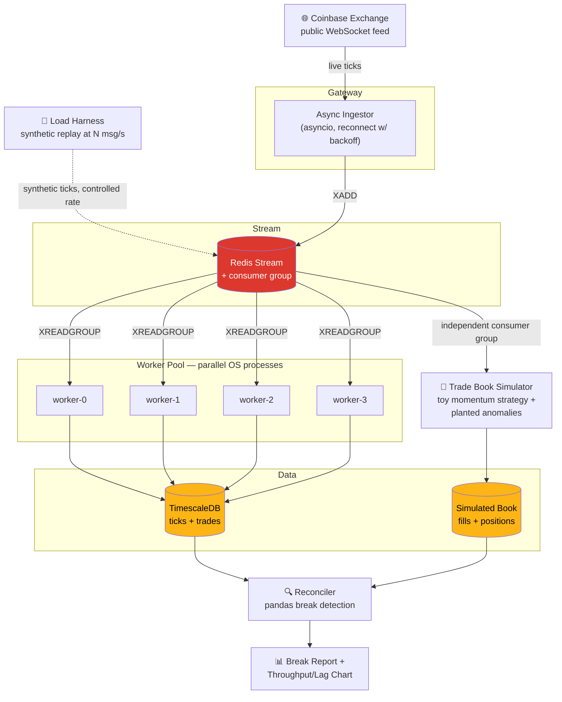
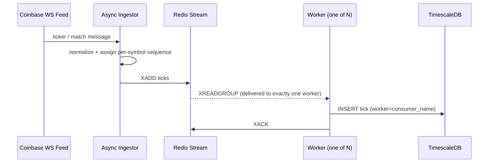
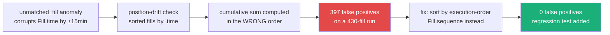
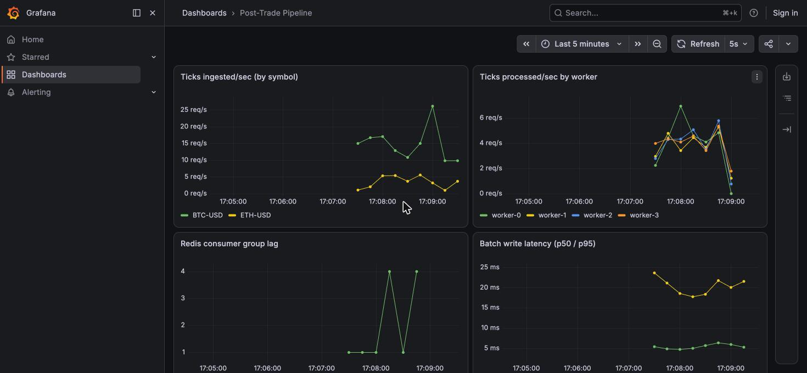

# Post-Trade Reconciliation Pipeline

[](https://github.com/praneethgaddam07/post-trade-reconciliation-pipeline/actions/workflows/ci.yml)


A distributed Python system that ingests a live public crypto market data
feed, fans it out across multiple OS processes via Redis Streams, writes it
to TimescaleDB, runs a toy trade book simulator against the same feed with
deliberately planted anomalies, and reconciles the simulated book against
observed market data — then load-tests the whole thing to find out exactly
where it stops keeping up.

Built against the entry-level Python posting skills ladder (OO Python →
async/concurrent processing → distributed systems under load): typed
domain models throughout, `asyncio` for ingestion, Redis Streams with a
consumer group (not pub/sub) for real multi-process fan-out, and a load
harness that reports the actual measured ceiling rather than an estimate.

**Every number below came from an actual run of this code.** No estimates,
no rounding up — where the system fell short of "clean," that's reported too
(see [Limitations](#limitations)).

## Results at a glance

| | |
|---|---|
| **Distributed worker pool** | 4 OS processes, 938/938 messages processed — zero loss, zero duplication (verified two independent ways) |
| **Reconciler precision / recall** | `unmatched_fill` **1.000 / 1.000** · `position_drift` **1.000 / 1.000** · `sequence_gap` 51/53 events |
| **Publisher throughput ceiling** | client-side saturation at **~80,000–140,000 msg/s** (batched, multi-process publisher; ramped 2,000 → 1,500,000 msg/s target) |
| **Worker/store pipeline ceiling** | **still not found** — fully drained a 174,000-message backlog every time, even at 1.5M msg/s target |
| **Bugs found & fixed via this measurement** | position-drift sort-key bug (397 false positives) and a single-asyncio-loop publisher masquerading as "the ceiling" — both root-caused, fixed, regression-tested |
| **Test suite** | **29/29 passing**, incl. a crash/recovery test (worker dies mid-batch, `XAUTOCLAIM` reclaims its PENDING entries) — not just happy-path delivery |
| **Type/lint** | `mypy --strict` clean on `src/`, `ruff` clean, enforced on every push via GitHub Actions |
| **Observability** | structured JSON logs + Prometheus metrics per worker, live Grafana dashboard — [real screenshot below](#observability), not a mockup |

## Architecture



**A single tick's journey**, end to end:



The consumer group is what makes this genuinely distributed: each message is
delivered to exactly one worker process, and Redis — not application code —
enforces that. Verified in the Results section below by cross-checking the
pool's own counts against an independent `GROUP BY worker` query on what was
actually written to TimescaleDB.

## Tech stack

- **Python 3.13**, fully type-hinted, Pydantic models for every domain object
  (`Tick`, `Trade`, `Fill`, `Position`, `Break`) — no bare dicts passed around
- **asyncio** for the ingest layer, with reconnect-with-backoff
- **Redis Streams with a consumer group** — several OS processes read from
  the *same* group, so work is actually split by Redis, not just by running
  multiple copies of a script
- **TimescaleDB** (via docker-compose) for tick storage; a DuckDB/Parquet
  fallback exists in `storage/timeseries_store.py` but wasn't needed —
  Timescale stood up cleanly
- **pandas** for reconciliation
- **pytest** + **fakeredis** for the test suite, including a real ephemeral-Redis
  integration test
- **matplotlib** for the load test chart
- **Prometheus + Grafana** for live metrics (ticks/sec by worker, consumer
  lag, batch write latency), **structured JSON logging** throughout the
  ingestor and workers

## How to run it locally

Requires Docker and outbound internet access to a public crypto WebSocket feed.

```bash
python3 -m venv .venv && source .venv/bin/activate
pip install -e ".[dev]"
docker compose up -d   # Redis, TimescaleDB, Prometheus, Grafana

# one end-to-end demo pass: ingest -> workers -> simulator -> reconcile
./scripts/run_load_test.sh   # find the throughput ceiling
./scripts/run_pipeline.sh    # ingest, drain, simulate anomalies, reconcile

pytest -v                    # 29 tests, unit + fakeredis integration
```

Grafana is live at `http://localhost:3000` (anonymous viewer access) once
the ingestor and workers are running — see [Observability](#observability)
below.

## Results

These are the actual numbers from real runs against the live Coinbase feed
and local Docker infra — see [`reports/break_report.md`](reports/break_report.md)
and [`reports/load_test_results.json`](reports/load_test_results.json) for
the raw output behind these tables.

### Multi-process worker pool — real parallelism, not just a claim

A 4-worker pool draining a 938-message backlog split the work across 4
distinct OS PIDs with no loss or duplication:

| Worker | Messages processed |
|---|---|
| worker-0 | 250 |
| worker-1 | 238 |
| worker-2 | 200 |
| worker-3 | 250 |
| **Total** | **938 (exact match, zero loss/duplication)** |

(Split is uneven by design — workers race for batches via `XREADGROUP`, so
the exact per-worker count varies run to run. What matters is that the total
always matches the backlog exactly.)

Verified two ways: the pool's own return values, and an independent
`GROUP BY worker` query against the rows actually written to TimescaleDB —
both agreed exactly.

**Crash recovery, not just happy-path delivery.** A worker can read a batch
via `XREADGROUP` and die before acking it — a real process crash, not a
hypothetical. `test_worker_crash_pending_entries_reclaimed_by_another_consumer`
reads a batch under one consumer name and abandons it (no ack, connection
just closed), then has a second consumer call `XAUTOCLAIM` to reclaim those
PENDING entries, finish the work, and ack them — then confirms the group's
PEL is genuinely empty afterward, not just re-claimable. This is what makes
"Redis Streams consumer group" a real fault-tolerance mechanism in this
project rather than a queue that happens to distribute reads.

### Reconciler — measured precision/recall against planted ground truth

The trade book simulator (Phase 5) plants three anomaly types against real
ingested ticks and logs each one as ground truth. The reconciler is scored
against that log, not eyeballed:

| Anomaly type | Planted | Found | Precision | Recall |
|---|---|---|---|---|
| `unmatched_fill` | 60 | 60 | 1.000 | 1.000 |
| `position_drift` | 51 | 51 | 1.000 | 1.000 |
| `sequence_gap` | 53 events | 51 contiguous runs | — | — |

`sequence_gap` is scored structurally (missing integer runs in stored tick
sequences), not by a shared ID — when two planted gaps land adjacent to each
other, they merge into one contiguous missing run in the data itself, which
is why found-runs can sit slightly below planted-events even at perfect
detection. Confirmed by direct analysis of the planted ranges, not assumed.

**A real bug found and fixed along the way:**



The first version of the position-drift check sorted fills by `time` to
recompute the cumulative position. But the `unmatched_fill` anomaly
deliberately corrupts `time` by ±15 minutes — sorting by it desynced the
cumulative sum from the book's true execution order. Fixed by adding an
execution-order `sequence` field to `Fill`, independent of timestamp, and
sorting by that instead. Regression test:
`test_position_drift_sorts_by_sequence_not_corrupted_timestamp`.

### Load test — the real throughput ceiling

**Generation 1** (single asyncio loop, one `XADD` per call, one autocommitted
`INSERT` per tick) found a publisher-bound ceiling at ~6,250 msg/s — see
[git history](../../commits/main) for those numbers. That result was itself
a finding worth keeping: the "ceiling" it found belonged to the load-test
tool, not the pipeline. So the tool was rebuilt:

- **Batched writes**: each worker's `XREADGROUP` batch (up to 2,000 ticks) is
  written to TimescaleDB in one `COPY` round-trip and acked in one `XACK`
  call, instead of one round-trip per tick.
- **Batched, multi-process publisher**: several OS processes each pipeline
  batches of `XADD` calls, mirroring the worker pool's fan-out on the
  producer side — so the measurement isn't capped by one process's
  single-core, one-call-at-a-time round-trip latency.

Re-ran the ramp from 2,000 to **1,500,000** msg/s target against the real
Redis Stream + 4-worker pool + TimescaleDB, sampling consumer lag throughout:

| Target rate | Actual publish rate | Peak lag | Fully drained after step |
|---|---|---|---|
| 2,000 | 1,787.7 | 0 | yes |
| 5,000 | 4,627.9 | 0 | yes |
| 10,000 | 9,219.1 | 0 | yes |
| 20,000 | 18,445.7 | 0 | yes |
| 40,000 | 37,293.7 | 0 | yes |
| 60,000 | 55,830.5 | 200 | yes |
| 80,000 | 74,292.8 | 200 | yes |
| 100,000 | 92,856.8 | 0 | yes |
| 150,000 | 139,363.4 | 5,200 | yes |
| 200,000 | 134,512.9 | 96,400 | yes |
| 350,000 | 118,965.6 | 173,800 | yes |
| 500,000 | 113,961.2 | 49,300 | yes |
| 750,000 | 89,490.2 | 89,400 | yes |
| 1,000,000 | 83,133.5 | 81,900 | yes |
| 1,500,000 | 102,336.9 | 117,800 | yes |


**Up to a ~150,000 msg/s target, achieved publish rate tracks the target
almost exactly with essentially zero queue lag** — the top panel's actual-rate
line rides the ideal diagonal cleanly on a log-log scale. Past that, the
publisher itself saturates and actual throughput plateaus in the
**~80,000–140,000 msg/s** range no matter how much higher the target is
pushed, with real run-to-run variance at extreme load (visible in the
non-monotonic 200k→1.5M numbers) — a sign of CPU contention on a single dev
machine (six publisher processes doing JSON serialization plus Redis's
single-threaded command execution), not a clean deterministic wall.

**The worker/store pipeline's ceiling still wasn't found.** Even the worst
backlog observed — 173,800 messages, built up during the 350,000 msg/s step —
fully drained to zero lag every single time within the grace period. Four
workers doing batched `COPY` writes absorbed everything the publisher could
throw at them. Finding *that* ceiling for real would mean building an even
faster publisher (e.g. Redis's own `redis-benchmark`, or a compiled client) —
a legitimate next step, and one this project stops short of rather than
estimate.

### Live ingestion rate (for context, not the ceiling)

Against the actual Coinbase feed (`ticker` + `matches` channels, BTC-USD and
ETH-USD), observed throughput ranged ~5–21 msg/s depending on real market
activity during the capture window. This is the exchange's rate, not this
system's — it's the load test above that characterizes the pipeline itself.

## Observability

Structured JSON logs (one object per line — `worker`, `pid`, `batch_size`,
`seq_start`/`seq_end`, `symbol` as real fields, not embedded in a format
string) and Prometheus metrics are wired into the ingestor and every worker:

- `posttrade_ticks_ingested_total{symbol,channel}` — Counter
- `posttrade_ticks_processed_total{worker}` — Counter
- `posttrade_batch_write_seconds{worker}` — Histogram (batch COPY latency)
- `posttrade_consumer_lag{group}` — Gauge, sampled after every batch

Each worker exposes its own scrape endpoint (`METRICS_PORT_WORKER_BASE` +
index) specifically so Grafana can break throughput down **per worker**, not
just as an aggregate — the whole point of a distributed worker pool is that
work is split across processes, and the dashboard should be able to show that
split, not hide it behind a sum.

Prometheus and Grafana are provisioned via `docker-compose.yml`
(`observability/prometheus.yml` for scrape targets, `observability/grafana/provisioning/`
for the datasource and dashboard) — no manual dashboard setup required.

This is a real screenshot, not a mockup — captured while the ingestor was
pulling live Coinbase ticks and 4 workers were draining them concurrently:



Top-left tracks live ingestion split by symbol (BTC-USD vs ETH-USD); top-right
shows all 4 workers actively processing at once — distinct colored lines
because each worker really is a separate OS process with its own metrics
endpoint, not a single aggregate counter split after the fact.

**A note on the scrape networking model.** The ingestor and workers run as
host processes, not containers, so Prometheus (which does run in Docker)
needs `host.docker.internal` to reach back out and scrape them. That resolves
automatically on Docker Desktop / OrbStack; on Linux it needs the
`extra_hosts: host.docker.internal:host-gateway` entry already in
`docker-compose.yml` (a Docker Compose feature since Engine 20.10, not a
Docker-Desktop-only trick) — this was verified working on Mac/OrbStack for
the screenshot above, not re-verified against real Linux Docker in this
environment. If your setup doesn't support `host-gateway`, edit the static
targets directly in `observability/prometheus.yml`.

## Continuous integration

`.github/workflows/ci.yml` runs on every push and PR to `main`: `ruff check`,
`mypy --strict` against `src/`, `mypy` against `tests/` (a relaxed profile —
see the `[[tool.mypy.overrides]]` in `pyproject.toml`; strict-typing test
files isn't standard practice), and the full pytest suite against real Redis
and TimescaleDB service containers — the same infra dependency as running it
locally, not mocked away for CI's sake.

## Limitations

- **Single-machine Redis and Postgres**, not a cluster — this proves the
  consumer-group fan-out pattern works, not that it survives node failure.
- **The worker/store pipeline's real ceiling is still unknown** — even a
  batched, multi-process publisher pushed to 1.5M msg/s target never made it
  fall behind permanently. Finding that number would need an even faster
  publisher (e.g. `redis-benchmark` or a compiled client) to actually
  saturate the consumption side, which this project stops short of.
- **The publisher's own ~80k–140k msg/s plateau has real run-to-run
  variance at extreme load** — consistent with CPU contention between
  publisher and worker processes on one dev machine, not a clean
  deterministic wall. A multi-machine setup would isolate that variable.
- **Synthetic toy strategy**, not a live trading strategy — the trade book
  simulator's fills are randomized momentum trades, not anything
  economically meaningful.
- **`sequence_gap` ground truth is structural, not ID-based** — see the
  Results section above for why found-runs can sit slightly below
  planted-events even at perfect detection.

## Repo structure

```
post-trade-reconciliation-pipeline/
├── .github/workflows/    # ci.yml — ruff, mypy --strict, pytest on every push/PR
├── src/posttrade/
│   ├── models/          # Tick, Trade, Fill, Position, Break (Pydantic)
│   ├── ingest/           # async_ingestor.py
│   ├── queue/             # redis_stream.py
│   ├── workers/            # worker.py, worker_pool.py
│   ├── storage/             # timeseries_store.py, book_store.py
│   ├── simulate/              # trade_book_simulator.py
│   ├── reconcile/               # reconciler.py
│   ├── loadtest/                  # load_harness.py
│   ├── observability/               # logging_config.py, metrics.py
│   └── report/                        # report.py
├── observability/       # prometheus.yml, grafana provisioning + dashboard JSON
├── tests/               # 29 tests: unit + fakeredis integration
├── scripts/             # run_pipeline.sh, run_load_test.sh
├── reports/             # generated break_report.md, chart + json, Grafana screenshot
└── docker-compose.yml   # Redis, TimescaleDB, Prometheus, Grafana
```

