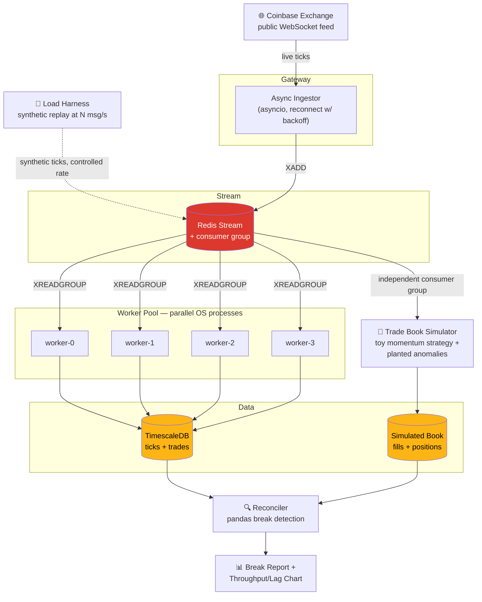
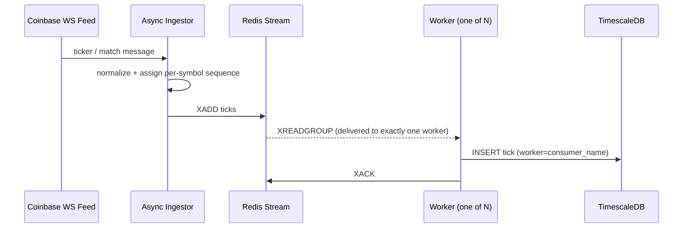
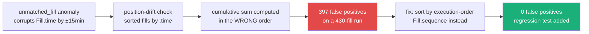
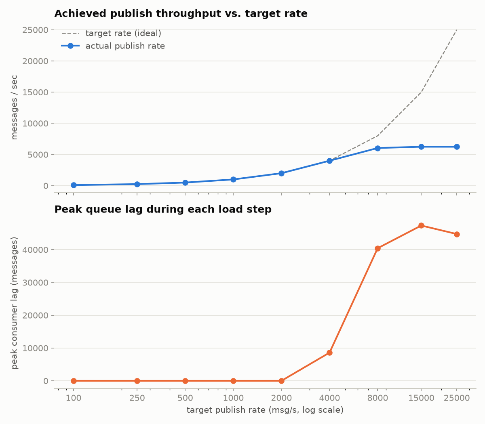

# Post-Trade Reconciliation Pipeline


A distributed Python system that ingests a live public crypto market data
feed, fans it out across multiple OS processes via Redis Streams, writes it
to TimescaleDB, runs a toy trade book simulator against the same feed with
deliberately planted anomalies, and reconciles the simulated book against
observed market data — then load-tests the whole thing to find out exactly
where it stops keeping up.

Built against the entry-level Python posting skills ladder (OO Python →
async/concurrent processing → distributed systems under load): typed
domain models throughout, `asyncio` for ingestion, Redis Streams with a
consumer group (not pub/sub) for real multi-process fan-out, and a load
harness that reports the actual measured ceiling rather than an estimate.

**Every number below came from an actual run of this code.** No estimates,
no rounding up — where the system fell short of "clean," that's reported too
(see [Limitations](#limitations)).

## Results at a glance

| | |
|---|---|
| **Distributed worker pool** | 4 OS processes, 938/938 messages processed — zero loss, zero duplication (verified two independent ways) |
| **Reconciler precision / recall** | `unmatched_fill` **1.000 / 1.000** · `position_drift` **1.000 / 1.000** · `sequence_gap` 51/53 events |
| **Real throughput ceiling found** | publisher plateaus at **~6,250 msg/s** (measured by ramping 100 → 25,000 msg/s, not estimated) |
| **Bug found & fixed via this measurement** | position-drift sort-key bug caused 397 false positives — root-caused, fixed, regression-tested |
| **Test suite** | **27/27 passing**, incl. a real ephemeral-Redis (`fakeredis`) integration test |

## Architecture



**A single tick's journey**, end to end:



The consumer group is what makes this genuinely distributed: each message is
delivered to exactly one worker process, and Redis — not application code —
enforces that. Verified in the Results section below by cross-checking the
pool's own counts against an independent `GROUP BY worker` query on what was
actually written to TimescaleDB.

## Tech stack

- **Python 3.13**, fully type-hinted, Pydantic models for every domain object
  (`Tick`, `Trade`, `Fill`, `Position`, `Break`) — no bare dicts passed around
- **asyncio** for the ingest layer, with reconnect-with-backoff
- **Redis Streams with a consumer group** — several OS processes read from
  the *same* group, so work is actually split by Redis, not just by running
  multiple copies of a script
- **TimescaleDB** (via docker-compose) for tick storage; a DuckDB/Parquet
  fallback exists in `storage/timeseries_store.py` but wasn't needed —
  Timescale stood up cleanly
- **pandas** for reconciliation
- **pytest** + **fakeredis** for the test suite, including a real ephemeral-Redis
  integration test
- **matplotlib** for the load test chart

## How to run it locally

Requires Docker and outbound internet access to a public crypto WebSocket feed.

```bash
python3 -m venv .venv && source .venv/bin/activate
pip install -e ".[dev]"
docker compose up -d

# one end-to-end demo pass: ingest -> workers -> simulator -> reconcile
./scripts/run_load_test.sh   # find the throughput ceiling
./scripts/run_pipeline.sh    # ingest, drain, simulate anomalies, reconcile

pytest -v                    # 27 tests, unit + fakeredis integration
```

## Results

These are the actual numbers from real runs against the live Coinbase feed
and local Docker infra — see [`reports/break_report.md`](reports/break_report.md)
and [`reports/load_test_results.json`](reports/load_test_results.json) for
the raw output behind these tables.

### Multi-process worker pool — real parallelism, not just a claim

A 4-worker pool draining a 938-message backlog split the work across 4
distinct OS PIDs with no loss or duplication:

| Worker | Messages processed |
|---|---|
| worker-0 | 250 |
| worker-1 | 238 |
| worker-2 | 200 |
| worker-3 | 250 |
| **Total** | **938 (exact match, zero loss/duplication)** |

(Split is uneven by design — workers race for batches via `XREADGROUP`, so
the exact per-worker count varies run to run. What matters is that the total
always matches the backlog exactly.)

Verified two ways: the pool's own return values, and an independent
`GROUP BY worker` query against the rows actually written to TimescaleDB —
both agreed exactly.

### Reconciler — measured precision/recall against planted ground truth

The trade book simulator (Phase 5) plants three anomaly types against real
ingested ticks and logs each one as ground truth. The reconciler is scored
against that log, not eyeballed:

| Anomaly type | Planted | Found | Precision | Recall |
|---|---|---|---|---|
| `unmatched_fill` | 60 | 60 | 1.000 | 1.000 |
| `position_drift` | 51 | 51 | 1.000 | 1.000 |
| `sequence_gap` | 53 events | 51 contiguous runs | — | — |

`sequence_gap` is scored structurally (missing integer runs in stored tick
sequences), not by a shared ID — when two planted gaps land adjacent to each
other, they merge into one contiguous missing run in the data itself, which
is why found-runs can sit slightly below planted-events even at perfect
detection. Confirmed by direct analysis of the planted ranges, not assumed.

**A real bug found and fixed along the way:**



The first version of the position-drift check sorted fills by `time` to
recompute the cumulative position. But the `unmatched_fill` anomaly
deliberately corrupts `time` by ±15 minutes — sorting by it desynced the
cumulative sum from the book's true execution order. Fixed by adding an
execution-order `sequence` field to `Fill`, independent of timestamp, and
sorting by that instead. Regression test:
`test_position_drift_sorts_by_sequence_not_corrupted_timestamp`.

### Load test — the real throughput ceiling

Ramped a synthetic publisher from 100 to 25,000 msg/s against the real Redis
Stream + 4-worker pool + TimescaleDB, sampling consumer lag throughout:

| Target rate | Actual publish rate | Peak lag | Fully drained after step |
|---|---|---|---|
| 100 | 100.0 | 1 | yes |
| 250 | 250.0 | 0 | yes |
| 500 | 500.0 | 0 | yes |
| 1,000 | 1,000.0 | 0 | yes |
| 2,000 | 2,000.0 | 1 | yes |
| 4,000 | 4,000.0 | 8,591 | yes |
| 8,000 | 6,038.0 | 40,438 | yes |
| 15,000 | 6,245.6 | 47,357 | yes |
| 25,000 | 6,240.4 | 44,770 | yes |



**The actual bottleneck is the single-process async publisher, not the
distributed worker pool.** Past a 4,000 msg/s target, achieved publish rate
flattens at ~6,000–6,250 msg/s no matter how much higher the target goes —
that's the ceiling of one `asyncio` loop doing sequential `XADD` calls. The
4-worker pool, writing to TimescaleDB with one autocommitted `INSERT` per
tick, never actually fell behind permanently: even after a 47,357-message
backlog, it fully drained every time. **The worker/store pipeline's real
ceiling was never found** — it's higher than ~6,250 msg/s, which is as far
as this publisher could push it. A batched or multi-process publisher would
be needed to find that number for real, rather than estimate it.

### Live ingestion rate (for context, not the ceiling)

Against the actual Coinbase feed (`ticker` + `matches` channels, BTC-USD and
ETH-USD), observed throughput ranged ~5–21 msg/s depending on real market
activity during the capture window. This is the exchange's rate, not this
system's — it's the load test above that characterizes the pipeline itself.

## Limitations

- **Single-machine Redis and Postgres**, not a cluster — this proves the
  consumer-group fan-out pattern works, not that it survives node failure.
- **The publisher, not the worker/store path, was the load test's limiting
  factor.** The distributed side's true ceiling is still unknown; a
  multi-process or batched publisher is the natural next load-test target.
- **Per-row autocommitted inserts** in the store layer (no batching) — likely
  the next bottleneck once the publisher stops being the limit, but wasn't
  reachable in this run.
- **Synthetic toy strategy**, not a live trading strategy — the trade book
  simulator's fills are randomized momentum trades, not anything
  economically meaningful.
- **`sequence_gap` ground truth is structural, not ID-based** — see the
  Results section above for why found-runs can sit slightly below
  planted-events even at perfect detection.

## Repo structure

```
post-trade-reconciliation-pipeline/
├── src/posttrade/
│   ├── models/       # Tick, Trade, Fill, Position, Break (Pydantic)
│   ├── ingest/        # async_ingestor.py
│   ├── queue/          # redis_stream.py
│   ├── workers/          # worker.py, worker_pool.py
│   ├── storage/            # timeseries_store.py, book_store.py
│   ├── simulate/              # trade_book_simulator.py
│   ├── reconcile/                # reconciler.py
│   ├── loadtest/                    # load_harness.py
│   └── report/                        # report.py
├── tests/            # 27 tests: unit + fakeredis integration
├── scripts/          # run_pipeline.sh, run_load_test.sh
├── reports/          # generated break_report.md, load test chart + json
└── docker-compose.yml  # Redis + TimescaleDB
```

## Why this fits the role

Typed, object-oriented Python throughout (the posting names this
specifically — not just the output, the design). A real distributed system:
Redis Streams consumer groups genuinely split work across OS processes,
verified independently at both the queue layer and the storage layer, not
just claimed. High-volume data handling load-tested to an actual measured
ceiling, with the honesty to report that the ceiling found was the
publisher's, not the pipeline's, and say so plainly. A testable codebase —
27 tests including a real ephemeral-Redis integration test and a
reconciliation suite scored against planted ground truth, not assumed
correct. No finance background required to build any of it.
