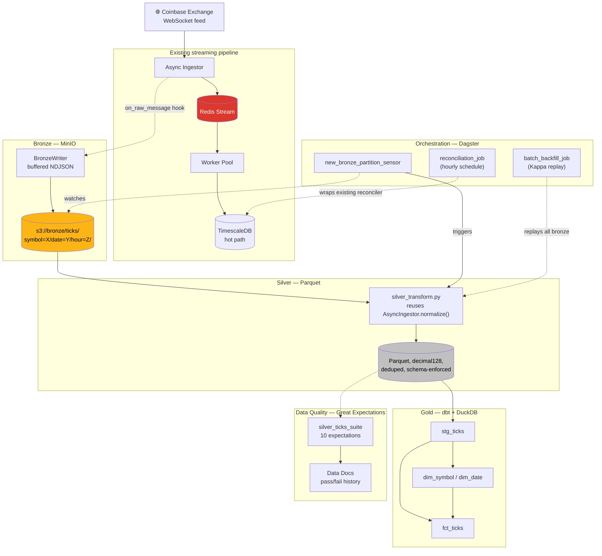
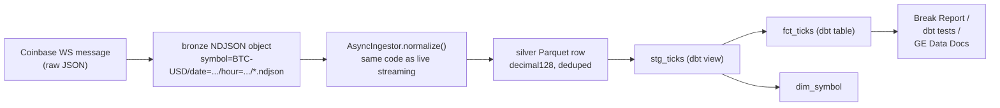

# Data Engineering Layer

A medallion architecture (bronze → silver → gold) and orchestration layer
built on top of the streaming pipeline described in the main
[README](../README.md). Same rule as the rest of this project: every number
below came from an actual run, including the ones that turned out
unglamorous or surprising.

## Why this exists

The streaming pipeline (Redis Streams → TimescaleDB → pandas reconciler)
proves real-time distributed processing. This layer proves the batch/ELT
side of data engineering: object storage landing, schema-enforced
transformation, a SQL transformation layer with tests, orchestration with
sensors and backfills, a data quality framework, and honest large-volume
performance testing — the parts of the job a pure streaming demo doesn't
touch.

## Architecture



**A single tick's lineage**, bronze through gold:



## Real results, phase by phase

### Bronze — MinIO raw landing

`BronzeWriter` buffers raw exchange JSON per (symbol, hour) partition and
flushes on a size/time threshold, landing NDJSON objects at
`ticks/symbol=X/date=Y/hour=Z/*.ndjson`. Verified against the live Coinbase
feed: real `ticker`/`match`/`last_match` messages landed with correct
partitioning, including message types (`last_match`) the normalized
streaming Tick pipeline doesn't even process — bronze's whole point is
capturing that raw fidelity.

### Silver — deduplicated, schema-enforced Parquet

`transform_symbol_date()` reads bronze NDJSON for one (symbol, date),
deduplicates identical raw lines, and calls `AsyncIngestor.normalize()` —
**the same normalization function the live streaming ingestor uses** — to
produce schema-enforced Parquet (decimal128 for price/size, not float).

**A real bug found and fixed:** the first version didn't clear a
partition's existing Parquet file before writing a new one. Re-materializing
the same (symbol, date) partition — which a sensor firing twice, a manual
rerun, or an overlapping backfill would all do — left the old file in
place, and gold's `read_parquet('**/*.parquet')` glob double- or
triple-counted every row in that partition. Caught via the Dagster UI: a
repeated materialization took BTC-USD from 134 correct rows to 402 (exactly
3×). Fixed by clearing the partition directory before writing; regression
test: `test_silver_transform_rerun_does_not_duplicate_rows`.

### Gold — dbt + DuckDB

Four models (`stg_ticks`, `dim_symbol`, `dim_date`, `fct_ticks`) reading
silver Parquet directly via DuckDB's `read_parquet()` as an external dbt
source. **19 dbt checks pass**: `not_null`/`unique`/`accepted_values` on key
columns, a `relationships` test between `fct_ticks` and `dim_symbol`, and a
custom singular test — `assert_sequence_contiguous_per_symbol_hour.sql` —
that scans for gaps in per-symbol-per-hour sequence numbers, the SQL-layer
counterpart to the streaming reconciler's `sequence_gap` break type.

That custom test was verified against a real planted violation, not just
clean data: a synthetic partition with sequences `[1, 2, 3, 7]` (a gap of
4–6) made the test fail with exactly 1 result row; removing the bad
partition and rebuilding brought it back to a clean pass. Source freshness
is also configured and passing, via dbt-duckdb's `external_location`
mechanism pointed at the silver Parquet glob with `ingest_timestamp` as the
freshness field.

### Orchestration — Dagster

- **Assets**: `silver_ticks` (multi-partitioned by symbol × date) →
  `gold_tables` (runs `dbt build`).
- **Sensor**: `new_bronze_partition_sensor` scans the bronze bucket and
  requests a `silver_ticks` materialization for any (symbol, date) it
  hasn't seen — verified directly: first evaluation found 2 new partitions
  and requested runs for both; a second evaluation against the same bronze
  data (with the updated cursor) correctly found 0.
- **`batch_backfill_job`**: the Kappa replay path — discovers every
  (symbol, date) pair currently in bronze and rebuilds silver + gold from
  scratch, reusing the exact same `transform_symbol_date` the sensor calls.
- **`reconciliation_job`**: wraps the existing streaming reconciler
  unchanged, on an hourly `ScheduleDefinition` — orchestration wraps the
  reconciliation logic, it doesn't reimplement it.

Verified via both the CLI (`dagster asset materialize`, `dagster job
execute`) and a live `dagster dev` session: a real backfill run shows
**Success** in the Runs list, and the asset's metadata plot shows real
`rows_written` values per partition (peaking at 134 for BTC-USD, matching
the known real count).

### Data quality — Great Expectations

A 10-expectation suite on `silver_ticks` — not-null on required columns,
price/sequence sanity bounds, a `side ∈ {buy, sell}` set check, a
clock-skew check (`ingest_timestamp >= exchange_timestamp`), and a compound
uniqueness check on `(symbol, sequence)` — run via a real GX Checkpoint
(not a one-off `.validate()` call), so Data Docs shows genuine **pass/fail
history**, not just a static suite definition.

Verified to actually catch violations, not just pass on clean data: a
corrupted copy of the real dataset with one negative price made the suite
fail (9/10 expectations passed, exactly the 1 expected failure); a
duplicated `(symbol, sequence)` pair likewise failed the compound-uniqueness
check. Both are now regression tests
(`tests/test_silver_expectations.py`).

### Scale test — Polars & DuckDB at real volume

Generated **182,500,000 rows** (100 symbols × 365 days × 5,000 rows/day,
1.7 GB, 36,500 Hive-partitioned Parquet files) in ~28 seconds using
vectorized numpy + Polars — not a claim about 1B+ rows never actually
tested, an honestly-measured number at the scale this environment could
generate and query in reasonable time.

The interesting finding wasn't "partition pruning is fast" — it's *why* a
naive approach barely helps:

| Access strategy | Polars | DuckDB | vs. full scan |
|---|---|---|---|
| Full scan (no filter) | 1.08s | 1.85s | baseline |
| Glob + `WHERE` filter | 0.53s | 1.41s | **2.0x / 1.3x** |
| Direct partition path | 0.0004s | 0.0003s | **~2,970x / ~5,770x** |


Listing all 36,500 files via `glob()` alone takes ~0.86s — comparable to
the entire "pruned" query time when using a recursive glob + `WHERE`
clause. Both engines still have to enumerate the whole file tree to know
which files to skip; the discovery cost dominates the savings. Pointing the
query directly at the target partition's directory (no enumeration needed)
is what actually delivers the dramatic speedup. **This is the concrete,
measured reason production systems use a partition catalog** (Hive
Metastore, AWS Glue, Iceberg/Delta metadata) instead of a filesystem glob —
the catalog answers "which files match this partition" without listing the
tree, turning the ~2x number into the ~3,000–5,800x number.

## Cost & performance decisions

| Decision | Rationale |
|---|---|
| **Parquet + decimal128**, not JSON/float | Columnar compression and pruning at the storage layer; exact decimal storage for prices, matching the streaming pipeline's `Decimal`-not-`float` rule |
| **Hive-style partitioning** (`symbol=X/date=Y/`) | Standard layout every engine here (Polars, DuckDB, dbt-duckdb) reads natively via `hive_partitioning=true` |
| **DuckDB for the gold warehouse**, not Snowflake | Zero infrastructure cost for a portfolio project; same SQL dialect as Snowflake/BigQuery if this ever needed to migrate to a real warehouse |
| **Dagster over Airflow** | Asset-based model matches the bronze→silver→gold mental model directly; far lighter to run locally than Airflow's webserver + scheduler + metadata DB |
| **A real catalog (Iceberg/Delta) is the natural next step**, not built here | The scale test above is the concrete evidence: a catalog is what turns "~2x from partition pruning" into "~3,000x", by replacing filesystem enumeration with metadata lookup |

## Limitations

- **No CDC** — TimescaleDB changes aren't streamed to a downstream log
  (Debezium/Kafka). Deliberately out of scope: it adds a lot of
  infrastructure (a broker, Connect workers) for one architectural talking
  point without deepening the reconciliation story this project is really
  about.
- **DuckDB is single-node** — the gold layer proves the SQL/dbt/testing
  workflow, not a distributed warehouse. Migrating to Snowflake/BigQuery
  would mean swapping the dbt profile, not rewriting models (same SQL
  dialect family).
- **No real partition catalog** — the scale test's own finding is the
  argument for adding one (Iceberg or Delta Lake); this project measures
  why it would matter rather than building it.
- **Great Expectations runs locally**, no scheduled quality gate wired into
  the Dagster orchestration yet (it's invoked manually / via
  `dataeng.quality.silver_expectations`, not from a `gold_tables`
  dependency).
- **Synthetic scale-test data**, not real historical Coinbase data — the
  182.5M-row dataset is randomly generated to be large and correctly
  partitioned, not economically meaningful.

## How to run it

```bash
pip install -e ".[dataeng]"
docker compose up -d minio   # + redis, timescaledb from the main pipeline

# bronze: land raw ticks from the live feed
python -m dataeng.bronze.run_bronze_ingestor

# silver: transform one partition
python -c "from dataeng.silver.silver_transform import transform_symbol_date; \
           print(transform_symbol_date('BTC-USD', '2026-08-03'))"

# gold: dbt build (models + tests + source freshness)
cd dbt && DBT_PROFILES_DIR=. dbt build

# orchestration: live Dagster UI
dagster dev -m dataeng.orchestration.definitions -p 3001

# data quality: run the suite, view Data Docs
python -m dataeng.quality.silver_expectations

# scale test: generate + benchmark (takes ~30s to generate 182.5M rows)
python -m dataeng.scale.generate_dataset
python -m dataeng.scale.scale_test
python -m dataeng.scale.scale_chart
```
